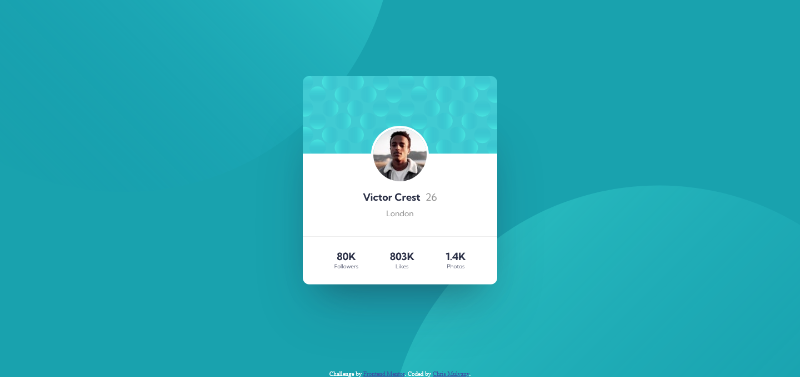

# Frontend Mentor - Profile card component solution

This is a solution to the [Profile card component challenge on Frontend Mentor](https://www.frontendmentor.io/challenges/profile-card-component-cfArpWshJ). Frontend Mentor challenges help you improve your coding skills by building realistic projects. 

## Table of contents

- [Overview](#overview)
  - [The challenge](#the-challenge)
  - [Screenshot](#screenshot)
  - [Links](#links)
- [My process](#my-process)
  - [Built with](#built-with)
  - [Continued development](#continued-development)
- [Author](#author)

**Note: Delete this note and update the table of contents based on what sections you keep.**

## Overview

### The challenge

- Build out the project to the designs provided

Your challenge is to build out this profile card component and get it looking as close to the design as possible.
You can use any tools you like to help you complete the challenge. So if you've got something you'd like to practice, feel free to give it a go.

### Screenshot

### Links

- Solution URL: [Add solution URL here](https://your-solution-url.com)
- Live Site URL: [Github Pages](https://chrismulvanygh.github.io/profile-card-component/)

## My process

### Built with

- Semantic HTML5 markup
- CSS custom properties
- Flexbox
- Mobile-first workflow

### Continued development

I really need to improve my pixel perfect layouts and improve on the time it takes me to convert from Image to Coded solution.

## Author

- Website - [Chris Mulvany](https://www.chrismulvany.com)
- Frontend Mentor - [@ChrisMulvanyGH](https://www.frontendmentor.io/profile/ChrisMulvanyGH)
- Twitter - [@ChrisMulvany](https://twitter.com/ChrisMulvany)

